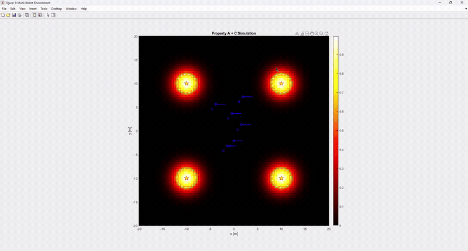
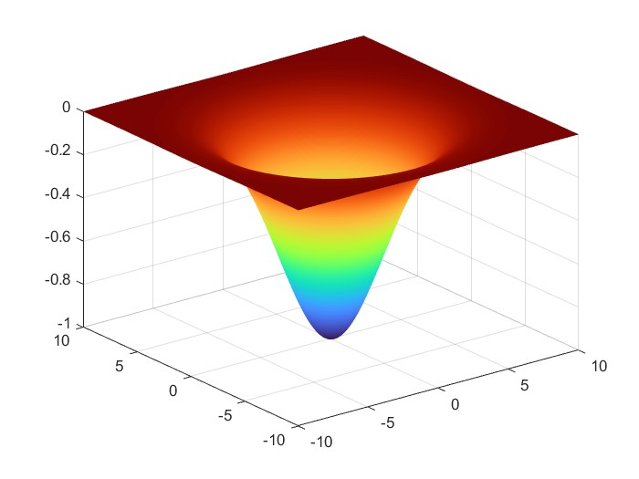
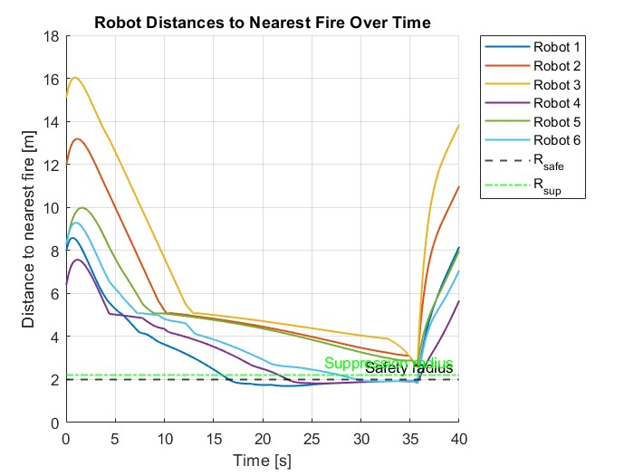
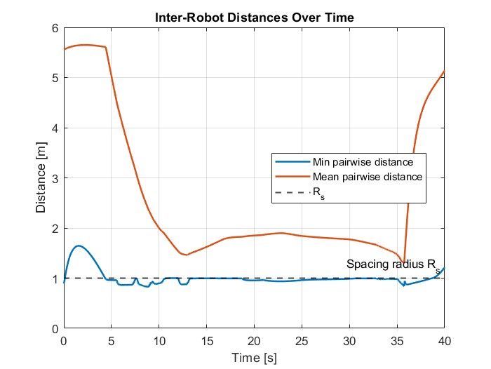
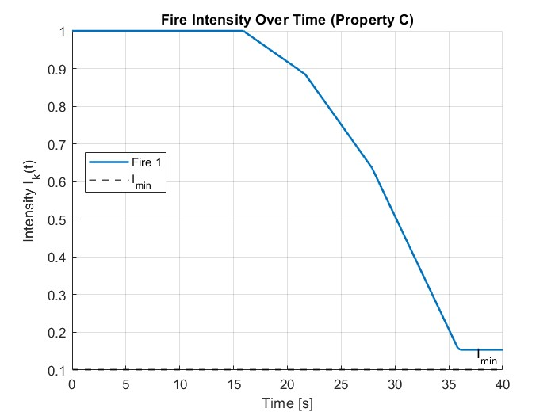
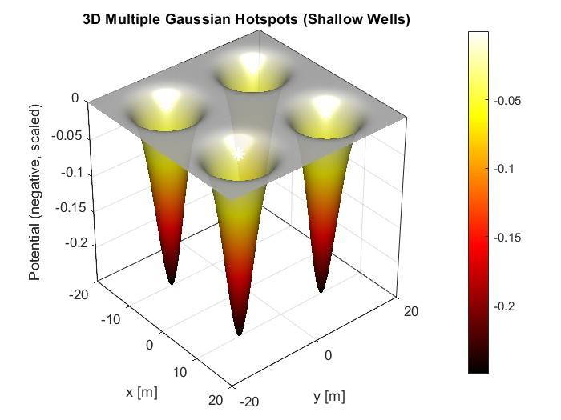
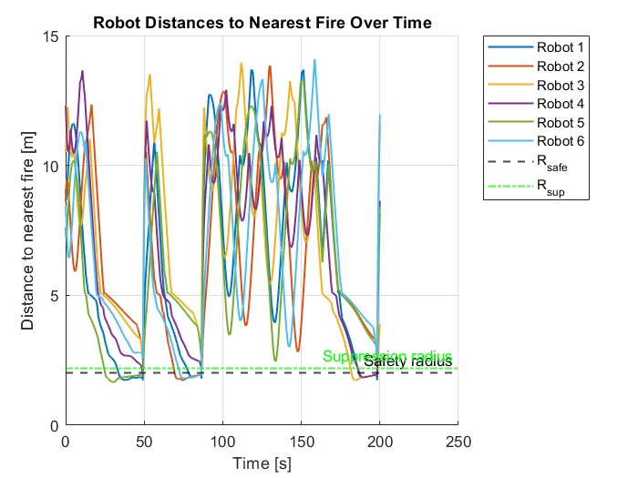
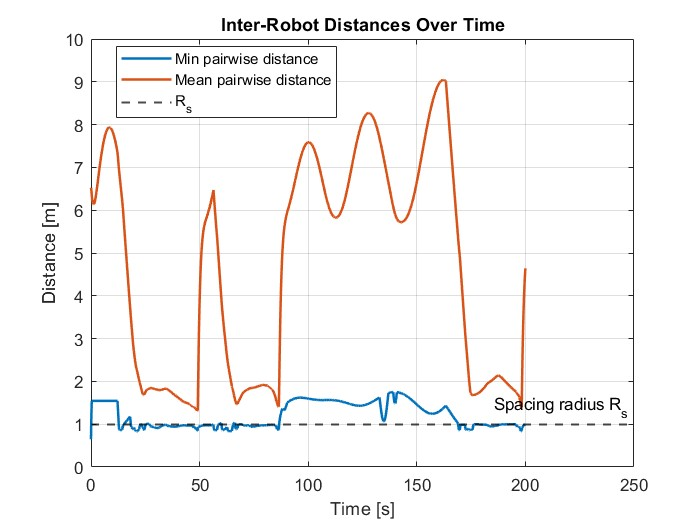
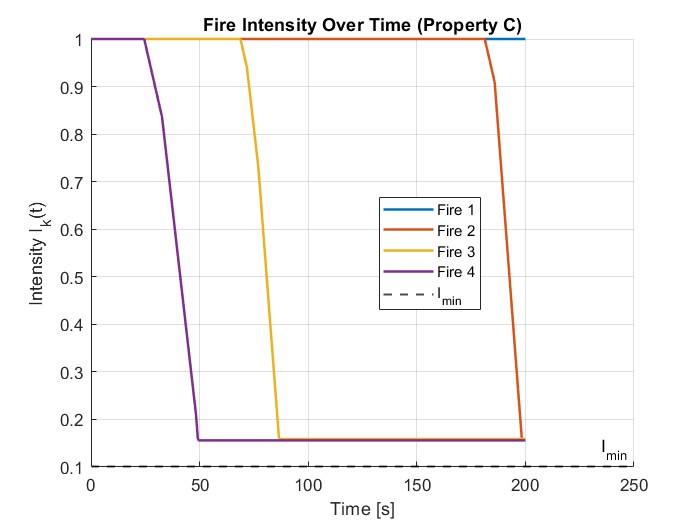

# Multi-Robot Firefighting Using Aggregation Behavior

**Kanav Prashar, Varad Jahagirdar, Harsh Padmalwar, Dhiren Makwana**

A MATLAB-based simulation of a decentralized multi-robot firefighting system. Robots use temperature gradients as fire cues, aggregate toward hotspots via potential-field navigation, maintain safe spacing through mutual repulsion, and suppress fires sequentially — all without centralized control.

> **Full technical report:** [docs/report.pdf](docs/report.pdf)

---

## Simulation Demo

<p align="center">
  
</p>

### Full Simulation Video

<p align="center">
  <video src="media/simulation.mp4" width="900" controls>
    <a href="media/simulation.mp4">Download simulation video</a>
  </video>
</p>

---

## Overview

Indoor firefighting exposes human responders to extreme risk. This project investigates how a team of **six autonomous ground robots** can cooperatively detect and suppress multiple simultaneous fire hotspots in a 20 × 20 m workspace using only:

- Local temperature sensing (no prior map of fire locations)
- Proximity-based inter-robot repulsion
- All-to-all position/water-level communication

The core insight is that simple **gradient-following** (move toward hotter regions) combined with **pairwise repulsion** produces emergent cooperative behavior: robots aggregate near fires while staying spread out enough to avoid interference.

Two theoretical properties are proven and validated in simulation:

- **Property A — Aggregation with Spacing:** Robots converge to fire hotspots while maintaining a nonzero separation distance.
- **Property C — Finite-Time Fire Extinction:** Fire intensity reaches a safe threshold in finite time whenever a sufficient number of robots are in suppression mode.

---

## Mathematical Model

### Robot Motion

Each robot moves as a first-order point-mass agent. Its velocity is the superposition of four components:

$$\dot{x}_i(t) = F_i^{\text{grad}}(t) + \sum_{j \neq i} F_{ij}^{\text{rep}}(t) + F_i^{\text{wall}}(t) + F_i^{\text{refill}}(t)$$

| Force term | Description |
|---|---|
| $F_i^{\text{grad}}$ | Attraction along temperature gradient toward fire |
| $F_{ij}^{\text{rep}}$ | Repulsion from robot $j$ when closer than spacing radius $R_s$ |
| $F_i^{\text{wall}}$ | Repulsion from walls/obstacles |
| $F_i^{\text{refill}}$ | Attraction toward refill station when water is low |

### Temperature Field

Each hotspot $k$ contributes a Gaussian temperature bump:

$$T_k(x) = I_k(t)\,\exp\!\left(-\frac{\|x - f_k\|^2}{2\sigma^2}\right)$$

The total field is $T(x,t) = \sum_{k=1}^{M} T_k(x)$, and robots follow $\nabla T$ to locate hotspots.

### Fire Suppression Dynamics

Fire intensity decays as robots enter the suppression zone:

$$\dot{I}_k(t) = -\beta\, N_k(t)$$

where $N_k(t)$ is the number of robots actively suppressing hotspot $k$. A fire is extinguished when $I_k \leq I_{\min}$.

### Mode Switching

Each robot operates in one of four modes:

| Mode | Trigger |
|---|---|
| **Search** | Default; follow temperature gradient |
| **Suppress** | Sufficiently close to an active fire |
| **Go-to-refill** | Water level $W_i$ drops below threshold |
| **Refilling** | Arrived at refill station |

---

## Simulation Results

### Single-Fire Scenario

<p align="center">
  
</p>

**Figure 1** — Gaussian potential well generated by a single fire hotspot. Robots follow the gradient of this surface toward the minimum (the fire).

<p align="center">
  
</p>

**Figure 2** — All six robots converge toward the fire while staying above the safety radius, confirming Property A.

<p align="center">
  
</p>

**Figure 3** — Minimum pairwise distance stays above zero and converges to $R_s$, confirming the spacing guarantee of Property A.

<p align="center">
  
</p>

**Figure 4** — Fire intensity drops almost linearly once enough robots enter the suppression zone, consistent with $\dot{I} = -\beta N(t)$ from Property C.

---

### Multiple-Fire Scenario (4 Hotspots)

<p align="center">
  
</p>

**Figure 5** — Four Gaussian wells in the 20 × 20 m workspace. Robots are attracted to whichever gradient they encounter first, producing decentralized multi-target coordination.

<p align="center">
  
</p>

**Figure 6** — Repeated dips show robots aggregating around one hotspot, suppressing it, then dispersing to find the next one — all from local rules alone.

<p align="center">
  
</p>

**Figure 7** — Spacing behavior is maintained even during transitions between hotspots. The minimum pairwise distance remains close to $R_s$ throughout.

<p align="center">
  
</p>

**Figure 8** — Sequential suppression: each fire's intensity remains high until robots arrive, then drops sharply and reaches $I_{\min}$, consistent with Property C in multi-fire environments.

---

## Repository Structure

```
.
├── env_setup.m               # World, robot, and fire parameters
├── temperature_field.m       # Temperature model and gradient function
├── robot_dynamics.m          # Robot motion model (all force terms)
├── propertyA.m               # Basic simulation (no external toolboxes)
├── propertyA_mrs.m           # Full animated simulation (MRS Toolbox)
├── visualize_potential_field.m  # Potential field plots
├── save_potential_field_figures.m
├── media/
│   ├── simulation.mp4        # Full simulation video
│   ├── simulation.gif        # Animated preview
│   └── images/               # Result figures from the report
└── docs/
    └── report.pdf            # Full technical report
```

### Key Files

| File | Purpose |
|---|---|
| `env_setup.m` | Central config: workspace size, robot count, fire positions, control gains |
| `temperature_field.m` | Computes $T(x)$ and $\nabla T$ used by all robots |
| `robot_dynamics.m` | Superposed velocity from attraction, repulsion, wall, and refill forces |
| `propertyA.m` | Lightweight simulation — no toolbox required |
| `propertyA_mrs.m` | **Main file** — full GUI simulation with Mobile Robotics Simulation Toolbox |
| `visualize_potential_field.m` | Generates Figures 1 and 5 (potential field surfaces) |

---

## How to Run

Run these files **in order** in MATLAB:

```matlab
% Step 1 — Initialize environment
run('env_setup.m')

% Step 2 — Load temperature model
run('temperature_field.m')

% Step 3 — Load robot motion model
run('robot_dynamics.m')

% Step 4 — Launch full simulation
run('propertyA_mrs.m')
```

**Requirements:** MATLAB with the [Mobile Robotics Simulation Toolbox](https://www.mathworks.com/matlabcentral/fileexchange/66586-mobile-robotics-simulation-toolbox). For a toolbox-free version, use `propertyA.m` instead of step 4.

---

## Customization

| File | What to change |
|---|---|
| `env_setup.m` | Number of robots, fire locations, $\beta$, $\sigma$, $R_s$, workspace size |
| `robot_dynamics.m` | Repulsion gain $k_{\text{rep}}$, suppression logic, wall avoidance |
| `propertyA_mrs.m` | Visualization layout, simulation duration, mode-switching thresholds |

---

## Contact

For questions or improvements, please open an issue in this repository.
